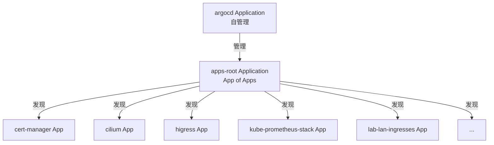
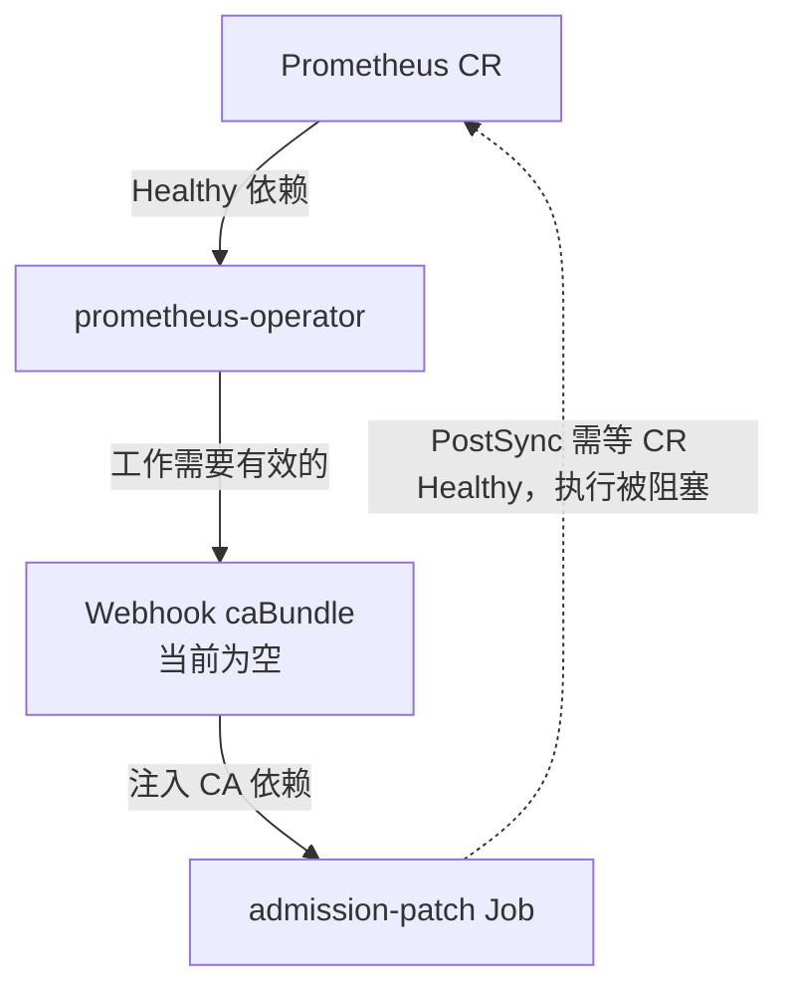

我的 homelab 有一个[使用 PVE 虚拟机部署的 3 节点 k8s 集群]()。我希望用一个 Git 仓库作为这个集群期望状态的唯一来源：所有基础设施变更先经过 review 提交到仓库，再由 Argo CD（CD 即 Continuous Delivery，持续交付）自动同步到集群。

这篇文章记录我选择 Argo CD 的考量、落地时的仓库结构，以及实践中遇到的几类典型问题。

## 1. 为什么选择 Argo CD

Kubernetes 生态里可选的 GitOps 控制器不少，除了 Argo CD，常见的还有 [Flux CD](https://fluxcd.io)、[Rancher Fleet](https://fleet.rancher.io)、[GitLab Agent for Kubernetes](https://docs.gitlab.com/user/clusters/agent/)，以及各云厂商的托管 GitOps 服务。

- **Flux CD**：CNCF 毕业项目，没有默认 Web UI，强调可组合、可脚本化。工作流高度依赖命令行和 CI 流水线时，Flux 更合适。
- **Rancher Fleet**：深度集成 Rancher 生态，适合已经有 Rancher 管理面的环境；独立使用时的社区资源和周边工具明显少于 Argo CD。
- **GitLab Agent for Kubernetes**：主要服务 GitLab 用户的 CI/CD 场景，GitOps 只是其中一部分能力，通用性受限。
- **Argo CD**：CNCF 毕业项目，同时提供 Web UI 和 CLI；周边工具链（[Argo Rollouts](https://argoproj.github.io/argo-rollouts/)、[Argo Workflows](https://argoproj.github.io/argo-workflows/)）和社区插件都比较丰富。

从采用度来看，Argo CD 目前是 Kubernetes GitOps 场景下最主流的选择。根据 [CNCF 2025 Argo CD End User Survey](https://www.cncf.io/announcements/2025/07/24/cncf-end-user-survey-finds-argo-cd-as-majority-adopted-gitops-solution-for-kubernetes/)，近六成受访者管理的 Kubernetes 集群使用 Argo CD 进行应用交付，用户推荐意愿也较高（NPS 79）。对于我的 homelab，Argo CD 的 UI、自动同步和自管理能力减少了手写脚本的工作量。

## 2. Argo CD 的核心概念与 homelab 落地结构

### 2.1 核心概念

Argo CD 把 Git 仓库当作集群期望状态的来源，通过 `Application` 资源（Argo CD 自定义的 k8s CRD）把仓库中的配置同步到 Kubernetes。我在 homelab 里最常用的概念包括：

- **Application**：最基本的同步单元，定义从哪个仓库的哪个路径同步到集群的哪个命名空间。
- **App of Apps**：用一个 Application 管理一组其他的 Application YAML。只要向被监控目录提交新的 Application，Argo CD 就会自动发现并同步，适合作为集群应用的根入口。详见 [Argo CD App of Apps](https://argo-cd.readthedocs.io/en/stable/operator-manual/cluster-bootstrapping/#app-of-apps)。
- **ApplicationSet**：基于生成器批量创建 Application，适合多环境、多租户或多副本场景；在单集群单环境的 homelab 中，单个 Application + [Helm](https://helm.sh) chart 通常更简洁。详见 [Argo CD ApplicationSet](https://argo-cd.readthedocs.io/en/stable/user-guide/application-set/)。
- **Multi-source Application**：一个 Application 可以引用多个来源，例如 Helm chart 来自上游 [OCI](https://helm.sh/docs/topics/registries/) 镜像仓库（如 `ghcr.io`），values 文件来自私有 Git 仓库。详见 [Argo CD Multiple Sources](https://argo-cd.readthedocs.io/en/stable/user-guide/multiple_sources/)。
- **Sync Policy**：`automated.prune` 控制是否自动清理 Git 中不存在的资源，`selfHeal` 控制是否自动修复偏离期望状态的手动改动。详见 [Argo CD Automated Sync Policy](https://argo-cd.readthedocs.io/en/stable/user-guide/auto_sync/)。
- **Sync Waves**：通过注解给资源分组，Argo CD 按 wave 顺序创建、反向删除，用来编排依赖关系。详见 [Argo CD Sync Waves](https://argo-cd.readthedocs.io/en/stable/user-guide/sync-waves/)。
- **Finalizer / Propagation Policy**：决定删除 Application 时是否级联删除其管理的资源，以及使用 foreground 还是 background 策略。详见 [Argo CD Application Deletion](https://argo-cd.readthedocs.io/en/latest/user-guide/app_deletion/)。

### 2.2 仓库结构

homelab 的 GitOps 仓库结构如下：

```text
.
├── clusters/prod/
│   ├── bootstrap/           # 一次性启动资源，不在 Argo CD 自拉取范围内
│   │   ├── argocd.yaml      # Argo CD 自管理 Application（multi-source）
│   │   └── apps-root.yaml   # App of Apps 根 Application，本身也是一个 Application 资源
│   └── apps/                # 集群应用入口：一组 Argo CD Application 定义
│       ├── cert-manager.yaml
│       ├── cilium.yaml
│       ├── higress.yaml
│       ├── kube-prometheus-stack.yaml
│       ├── lab-lan-ingresses.yaml
│       └── ...
├── infrastructure/          # 各组件配置（values、manifests、chart 等），被 apps 中的 Application 引用
│   ├── argocd/values.yaml
│   ├── cert-manager/
│   ├── cilium/
│   ├── higress/
│   ├── ingresses/           # ingress 层 Helm chart
│   └── kube-prometheus-stack/
└── scripts/bootstrap.sh     # 首次安装脚本
```

`clusters/prod/bootstrap/argocd.yaml` 是一个 multi-source Application，用于 Argo CD 首次部署就绪后，把 Argo CD 自身也纳入 GitOps 管理（自管理）：

```yaml
apiVersion: argoproj.io/v1alpha1
kind: Application
metadata:
  name: argocd
  namespace: argocd
  finalizers:
    - resources-finalizer.argocd.argoproj.io/foreground
spec:
  project: default
  sources:
    - repoURL: oci://ghcr.io/argoproj/argo-helm/argo-cd
      chart: argo-cd
      targetRevision: 10.4.0
      helm:
        valueFiles:
          - $values/infrastructure/argocd/values.yaml
    - repoURL: git@github.com:chaneyzorn/homelab.git
      targetRevision: main
      ref: values
  destination:
    server: https://kubernetes.default.svc
    namespace: argocd
  syncPolicy:
    automated:
      prune: true
      selfHeal: true
    syncOptions:
      - CreateNamespace=true
      - ServerSideApply=true
```

`clusters/prod/bootstrap/apps-root.yaml` 本身也是一个 Argo CD `Application` 资源，用 App of Apps 模式递归监听 `clusters/prod/apps/` 目录：

```yaml
apiVersion: argoproj.io/v1alpha1
kind: Application
metadata:
  name: apps-root
  namespace: argocd
  finalizers:
    - resources-finalizer.argocd.argoproj.io/foreground
spec:
  project: default
  source:
    repoURL: git@github.com:chaneyzorn/homelab.git
    targetRevision: main
    path: clusters/prod/apps
    directory:
      recurse: true
      exclude: 'README.md'
  destination:
    server: https://kubernetes.default.svc
    namespace: argocd
  syncPolicy:
    automated:
      prune: true
      selfHeal: true
    syncOptions:
      - Validate=true
```

`bootstrap/` 目录下是一次性启动资源，不在 Argo CD 自拉取范围内；如果其中内容发生变更，需要手动重新 apply。`scripts/bootstrap.sh` 会按以下顺序将它们应用到集群：

1. 通过 Helm 首次安装 Argo CD，等待其就绪；
2. apply `argocd.yaml`，让 Argo CD 完成自管理；
3. apply `apps-root.yaml`，让 Argo CD 开始发现 `clusters/prod/apps/` 下的应用。

之后新增基础设施组件时，只需在 `clusters/prod/apps/` 下提交一个 Application，Argo CD 就会自动发现并同步，不再需要手动 apply。组件自身的 Helm values 放在 `infrastructure/<组件名>/values.yaml` 中。

App of Apps 的层级关系如下：



## 3. 实践中遇到的几个典型问题

### 3.1 给 repo-server 配置 HTTP 代理

在国内网络下，Argo CD 的 `repo-server` 组件拉取 Helm chart 和 Git 仓库时需要经过 HTTP 代理。我把代理和超时环境变量放在 `infrastructure/argocd/values.yaml` 的 `repoServer.env` 下：

```yaml
repoServer:
  env:
    - name: HTTP_PROXY
      value: "http://10.8.8.94:7890"
    - name: HTTPS_PROXY
      value: "http://10.8.8.94:7890"
    - name: NO_PROXY
      value: "kubernetes.default.svc,127.0.0.1,localhost,10.0.0.0/8,172.16.0.0/12,192.168.0.0/16,.svc,.cluster.local"
    - name: ARGOCD_EXEC_TIMEOUT
      value: "10m"
```

这个配置会同时用于 `scripts/bootstrap.sh` 首次安装的 Helm 命令和 Argo CD 自管理后的同步，保证 bootstrap 阶段和 GitOps 阶段的网络行为一致。

### 3.2 让 bootstrap 和自管理共用同一份 values.yaml

为了让 bootstrap 脚本的首次安装和 Argo CD 自管理共用同一份 `infrastructure/argocd/values.yaml`，自管理 Application 使用 multi-source 同时引用上游 chart 和这份 values（完整定义见 2.2 节，这里只列出 `sources` 部分）：

```yaml
spec:
  sources:
    - repoURL: oci://ghcr.io/argoproj/argo-helm/argo-cd
      chart: argo-cd
      targetRevision: 10.4.0
      helm:
        valueFiles:
          - $values/infrastructure/argocd/values.yaml
    - repoURL: git@github.com:chaneyzorn/homelab.git
      targetRevision: main
      ref: values
```

`$values` 是第二个 source 的别名，Helm 渲染时会把 `infrastructure/argocd/values.yaml` 作为 value files 注入。这样 Argo CD 自管理时不需要执行 `helm dependency build`，直接从 OCI 仓库拉 chart、从 Git 拉 values。

在采用 multi-source 之前，我遇到过一个 values 结构不匹配的问题。当时 bootstrap 脚本和自管理 Application 安装 chart 的方式不同，对 `values.yaml` 的结构要求也不一样：

- **bootstrap 脚本直接安装 upstream chart**：

  ```bash
  helm upgrade --install argocd argo/argo-cd \
    -f infrastructure/argocd/values.yaml
  ```

  这种方式要求 `values.yaml` 扁平化，upstream chart 不识别顶层的 `argo-cd:` key。

- **Argo CD 自管理使用的 wrapper chart（已在 homelab 仓库中弃用）**：

  最初 `infrastructure/argocd/` 是一个 wrapper chart，结构如下：

  ```text
  infrastructure/argocd/
  ├── Chart.yaml          # 依赖 upstream argo-cd chart
  ├── values.yaml         # 配置嵌套在 argo-cd: 下
  └── .helmignore
  ```

  `Chart.yaml` 声明对 upstream chart 的依赖：

  ```yaml
  apiVersion: v2
  name: argocd
  description: Argo CD self-management wrapper chart for homelab
  type: application
  version: 0.1.0
  dependencies:
    - name: argo-cd
      version: 9.7.1
      repository: https://argoproj.github.io/argo-helm
  ```

  `values.yaml` 需要把配置嵌套在 `argo-cd:` 下：

  ```yaml
  argo-cd:
    repoServer:
      env: ...    # 与 3.1 节相同的环境变量，整体嵌套在 argo-cd: 下
  ```

  这种方式下，Argo CD 安装的是 wrapper chart，由 Helm 去解析 `argo-cd:` 嵌套 key。

问题就出在结构差异上：我在 bootstrap 时复用了写给 wrapper chart 的 `values.yaml`，嵌套在 `argo-cd:` 下的 key 会被 upstream chart 直接忽略，`repoServer.env` 等配置没有生效，`repo-server` 在国内网络下拉取 Helm chart 依赖时频繁超时。后来我放弃 wrapper chart，把 `values.yaml` 扁平化，改用前面介绍的 multi-source 写法同时引用 upstream chart 和扁平 values，两种安装方式才真正共用同一份配置。

### 3.3 大体积 CRD 需要 ServerSideApply

[`kube-prometheus-stack`](https://github.com/prometheus-community/helm-charts/tree/main/charts/kube-prometheus-stack) 的 CRD 体积很大，Argo CD 默认使用 client-side apply，会把整个 manifest 写入 `kubectl.kubernetes.io/last-applied-configuration` 注解，结果超过 Kubernetes 的 [262144 字节限制](https://kubernetes.io/docs/concepts/overview/working-with-objects/annotations/)，同步时报错：

```text
metadata.annotations: Too long: may not be more than 262144 bytes
```

我为该 Application 启用 [`ServerSideApply=true`](https://argo-cd.readthedocs.io/en/stable/user-guide/sync-options/) 后，CRD 成功安装。

### 3.4 Application finalizer 的使用方式

删除 Argo CD Application 时，如果希望它管理的 Kubernetes 资源一起被清理，就需要借助 finalizer 实现级联删除。Application 资源上带有 finalizer 时，Kubernetes 不会立刻删除这个 Application CR，而是先通知 Argo CD 的 application-controller 去清理它管理的子资源；controller 完成清理后再移除 finalizer，Application CR 才会真正消失。

Argo CD 实际识别的级联删除 finalizer 只有三个：

- `resources-finalizer.argocd.argoproj.io`
- `resources-finalizer.argocd.argoproj.io/foreground`
- `resources-finalizer.argocd.argoproj.io/background`

第一个是非域限定形式，能被 Argo CD 识别，但 Kubernetes 会提示建议使用带路径的域限定 finalizer 名称（`prefer a domain-qualified finalizer name including a path (/)`）。后两个在域限定的同时通过后缀指定[传播策略](https://kubernetes.io/docs/concepts/architecture/garbage-collection/)：

- **`foreground`**：Application CR 保留，直到所有子资源删除完成才释放 finalizer。这是默认行为，适合结构简单的应用；如果子资源自身也有 finalizer 或依赖关系复杂，删除过程容易卡住。
- **`background`**：Application CR 立即删除，子资源在后台异步清理。适合 `kube-prometheus-stack` 这类包含大量 CRD、StatefulSet、PVC 的重型基础设施，避免 foreground 等待导致删除卡死。

实际使用时，普通应用可以用 `resources-finalizer.argocd.argoproj.io/foreground`，`kube-prometheus-stack` 这类重型组件用 `resources-finalizer.argocd.argoproj.io/background`，根据应用复杂度选择合适的策略。

如果目的不是删除而是迁移，还有 **`orphan`（非级联删除）**：只删除 Application CR，保留所有子资源，通常通过 CLI 的 `--cascade=false` 触发，适合迁移或重构时先保留资源。

### 3.5 Helm hook 与 Argo CD 同步模型死锁

`kube-prometheus-stack` 默认用两个 Helm hook Job 管理 admission webhook 的 TLS 证书。这两个 hook 在 Argo CD 中映射为不同的类型，执行时机不同：

- **`admission-create`（pre-install hook）**：负责生成证书。Argo CD 把它映射为 [`PreSync` hook](https://argo-cd.readthedocs.io/en/stable/user-guide/resource_hooks/)，在同步开始前执行，不等待任何资源就绪，可以正常完成。
- **`admission-patch`（post-install hook）**：负责把 CA 注入 webhook 的 `caBundle`。Argo CD 把它映射为 `PostSync` hook，要等 Sync 阶段所有资源都 Healthy 后才执行——死锁正源于这个前提。

`PostSync` 的等待与证书注入方式叠加，形成一条首尾相接的依赖环：

- **Prometheus CR 要 Healthy**：需要 prometheus-operator 正常工作；
- **operator 要正常工作**：需要 webhook 的 `caBundle` 已注入有效 CA；
- **注入 CA 到 `caBundle`**：是 `admission-patch`（PostSync hook）的任务；
- **PostSync hook 要执行**：又要等 Prometheus CR Healthy。

对应的实体关系如下：



两端的等待在 Prometheus CR 上交汇：CR 等待证书注入，证书注入又等待 CR Healthy，双方都无法推进。

kube-prometheus-stack 官方为 webhook 证书提供了两种管理方式：上面这种默认的 hook Job 方式，以及 [cert-manager 方式](https://github.com/prometheus-community/helm-charts/tree/main/charts/kube-prometheus-stack#prometheus-operator-admission-webhooks)——启用后 chart 不再渲染 hook Job，而是交给 [cert-manager](https://cert-manager.io) 持续签发证书，并由它的 [cainjector](https://cert-manager.io/docs/concepts/ca-injector/) 组件把 CA 写入 webhook 的 `caBundle`。我采用的正是后者：

```yaml
prometheusOperator:
  admissionWebhooks:
    certManager:
      enabled: true
```

这样证书注入不再依赖 PostSync hook，死锁的前提随之消失。

### 3.6 删除组件不是 `git revert` 的对称操作

我在 homelab 里遇到过两次删除相关的问题：

- **`git revert` 后删除停滞**：下线一个组件时，我用一次 revert 同时删掉了 Application YAML 和它引用的渲染输入（values、chart 等）。随后 Application 在 UI 上显示 `ComparisonError` 并卡在 `Deleting`：渲染输入已不存在，Argo CD 无法渲染目标状态，也就无法执行级联清理。最后只能先恢复渲染输入，再手动清空 finalizers 才把它释放：

  ```bash
  kubectl patch application -n argocd <app-name> --type merge -p '{"metadata":{"finalizers":[]}}'
  ```

- **Application 改名后所有权冲突**：给一个 Application 改名后，同一组资源被新旧两个 Application 同时声明管理；旧 Application 的 finalizer 要求先清理资源，而这些资源已被新 Application 接管，删除与同步互相阻塞。

第一次事故暴露了删除 Application 的一个隐含前置条件：**Application 在被删除的瞬间必须仍然是可解析的**——controller 要先渲染出资源清单，才能确定要清理哪些资源。Argo CD 的 GitHub issue 里有不少同构的阻塞场景可以佐证：先删 AppProject 再删引用它的 Application，会卡在 DeletionError（[issue #4369](https://github.com/argoproj/argo-cd/issues/4369)）；同一个提交里同时删掉 project 和 application，后者因找不到 project 而无法继续清理（[issue #3175](https://github.com/argoproj/argo-cd/issues/3175)）。这些场景的共同点是：删除流程不是「带上 finalizer 就会自动清理」，Application 的定义和引用在删除完成前必须始终可用。

可以对照的是，各部署工具对历史状态的维护程度不同，删除能力也随之不同：

| 工具 | 是否维护历史状态 | 删除能力 | 代价 |
|---|---|---|---|
| Terraform | 是（state file） | 强，可精确 destroy | 需要管理 state，可能漂移 |
| Helm | 是（release Secret） | 中等，按 release 删除 | 依赖 release Secret，跨 release 共享资源难处理 |
| Flux Kustomization | 是（`.status.inventory`） | 中等，启用 prune 后可清理旧资源 | 需启用并维护 prune，共享资源仍需谨慎 |
| Argo CD | 轻量（tracking 注解、Application status） | 弱，依赖 finalizer/prune | 简单、无额外状态 |
| Kubernetes ownerReferences | 是（对象元数据） | 强，但只限同 namespace 父子关系 | 无法表达跨对象、跨 Application 依赖 |

落到实践上，删除组件时分两步提交：先只移除 Application YAML，等 Argo CD 完成级联清理、确认 Application CR 和受管资源都消失后，再删除渲染输入（values、chart 等）；一次 `git revert` 同时撤销两者是行不通的。重型组件可以把 finalizer 换成 `resources-finalizer.argocd.argoproj.io/background`，避免 foreground 等待加剧卡住的风险。

## 4. 用 AI 辅助 GitOps 运维

这次 homelab 的 GitOps 改造和故障排查，大量工作是在 AI 协助下完成的。最直接的收益是省去了重复劳动：GitOps 仓库里包含大量繁杂的 YAML——每接入一个组件就是一组 Application、values、chart 的组织工作，这类结构化文本 AI 处理效率较高；上文几次事故的报错定位和复盘整理，也比手工排查快。

协作中也暴露出一个需要特别注意的问题：**在 GitOps 仓库里，AI 必须意识到 `git push` 的敏感性**。在普通代码仓库中，`git commit` / `git push` 只是存档动作，AI 也习惯于“改完顺手提交推送”。而 GitOps 仓库里，合并到 main 的每一笔提交都会被 Argo CD 自动同步到集群——push 就是部署，如 3.6 节所示，一次提交甚至可能触发级联删除这样的不可逆操作。让不理解这一点的 AI 自由提交，相当于把生产变更的触发权交给一个把部署当成存档的助手。

我的做法是两层约束：

- **软约束：仓库里的 `AGENTS.md`**。明确规定纪律：未经明确授权，AI 不得执行 `git commit` 和 `git push`；修改先停在本地，说明改动内容，等待确认。这层约束依赖模型自觉遵守。
- **硬约束：工具侧的权限规则**。在 agent 配置中给 `git add` / `commit` / `push` 等命令配置强制询问（规则模式要写成 `*git*push*` 这类形式，才能匹配 `git add . && git push` 这样的复合命令），即使模型忘了纪律，命令也会被拦下来等我确认。

理想情况下两层互补，但实测硬约束目前并不可靠：我使用的 Kimi Code 在 yolo 模式（自动放行所有操作）下存在已知 bug，用户配置的 ask 规则不会触发（[issue #2455](https://github.com/MoonshotAI/kimi-code/issues/2455)）。规则写法本身正确，等官方修复后自然会生效；在此之前，真正起作用的只有 `AGENTS.md` 这层软约束和人工留意。

另一个有用的习惯是让 AI 把每次事故排查整理成带日期的 memory 文件留在仓库里，后续排查和写作（包括本文涉及的报错）都能引用当时的真实记录，而不是凭记忆复述。

这套环境目前还在持续演进中：Secret 管理方案尚未确定，[Gateway API](https://gateway-api.sigs.k8s.io/) 也只完成了 [Higress](https://higress.cn/) Ingress 这一阶段。后续有更多可复用的实践时，再单独记录。

## 5. 参考

- [CNCF End User Survey Finds Argo CD as Majority Adopted GitOps Solution for Kubernetes](https://www.cncf.io/announcements/2025/07/24/cncf-end-user-survey-finds-argo-cd-as-majority-adopted-gitops-solution-for-kubernetes/) —— CNCF 官方公告，2025 Argo CD 终端用户调查的主要结论。
- [Argo CD 2025 User Survey Results](https://blog.argoproj.io/argo-cd-2025-user-survey-results-ab045f7d5d9a) —— Argo 项目官方博客，2025 用户调查的完整结果。
- [Argo CD Application Deletion](https://argo-cd.readthedocs.io/en/latest/user-guide/app_deletion/) —— Argo CD 官方文档，介绍 Application 删除流程与 finalizer 级联清理。
- [Argo CD issue #4369: Deleting application stuck because of missing project](https://github.com/argoproj/argo-cd/issues/4369) —— 先删除 AppProject 再删除引用它的 Application 导致卡在 DeletionError 的 issue。
- [kube-prometheus-stack Helm chart](https://github.com/prometheus-community/helm-charts/tree/main/charts/kube-prometheus-stack) —— chart 源码与文档，包含 admission webhook 证书管理方式的说明。
- [Argo CD issue #3175: deleting project and application at the same time using autosync & prune](https://github.com/argoproj/argo-cd/issues/3175) —— 同一提交中同时删除 project 和 application 导致清理无法继续的 issue。
- [Argo CD Sync Options](https://argo-cd.readthedocs.io/en/stable/user-guide/sync-options/) —— Argo CD 官方文档，列出 ServerSideApply 等 syncOptions。
- [Argo CD Sync Waves](https://argo-cd.readthedocs.io/en/stable/user-guide/sync-waves/) —— Argo CD 官方文档，介绍 sync wave 的资源编排机制。
- [Argo CD Resource Tracking](https://argo-cd.readthedocs.io/en/stable/user-guide/resource_tracking/) —— Argo CD 官方文档，说明 Argo CD 如何跟踪受管资源。
- [Terraform destroy](https://developer.hashicorp.com/terraform/cli/commands/destroy) —— Terraform 官方 CLI 文档，基于 state 精确销毁资源。
- [Helm uninstall](https://helm.sh/docs/helm/helm_uninstall/) —— Helm 官方文档，按 release 卸载资源。
- [Flux Kustomization pruning](https://fluxcd.io/flux/components/kustomize/kustomizations/#pruning) —— Flux 官方文档，介绍 Kustomization 的 prune 机制。
- [Kubernetes ownerReferences](https://kubernetes.io/docs/concepts/overview/working-with-objects/owners-dependents/) —— Kubernetes 官方文档，介绍 ownerReferences 与级联删除。
