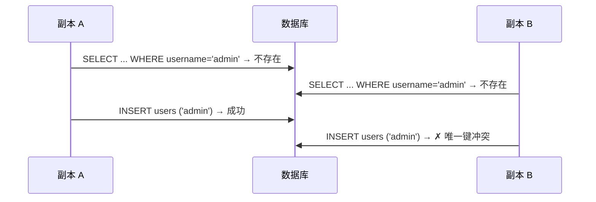

最近正在给公司重构一套独立的用户管理和认证鉴权组件。AuthX 启动时会做幂等初始化（bootstrap）：表结构迁移、创建默认管理员、创建预配置的服务账号。单实例下这套逻辑没有问题，但生产是多副本形态——K8s 滚动发布或 HPA 扩容时，多个副本可能同时执行这段代码。本文记录这个并发问题的处理过程：悲观锁、乐观锁、upsert 三种方案的取舍，以及 MySQL 唯一索引中 NULL 值带来的一个问题。

## 并发问题

初始化的典型写法是 check-then-create：先查“管理员是否存在”，不存在则插入。AI 实现的初版方案里，存在多实例并行启动时的并发问题，两个副本的执行时序可以交错成这样：



后到的副本 bootstrap 报错，实例崩溃重启。重启后看到管理员已存在就会跳过，理论上可以自愈，但发布期间会伴随崩溃循环和错误日志。

我指出这个问题后，AI 先用 advisory lock（悲观锁）实现了基线版本，把正确性解决了。随后我提出对锁的两点顾虑——绑定 MySQL 方言、以及锁超时带来的启动失败模型——并要求评估乐观锁和 upsert 两种不依赖锁的方案。这两种方案各有前提：乐观锁要求被修改的行已经存在并带有版本字段，upsert 要求目标表有真正生效的唯一索引。

验证悲观锁基线时的双副本冒烟带来了一个计划外的发现：终态检查时，`user_auth_methods` 里存在**两条** local 密码方法，密码还不一样。用户表正常、方法表却重复，原因见本文第四节。

## 乐观锁：不适用于插入竞态

乐观锁（optimistic locking）假设冲突很少发生：不阻止任何人操作，而是在提交修改时检查“我读取的数据在我动手期间有没有被别人改过”。经典实现是给表加一列版本号：

```sql
-- 读取时记下版本
SELECT role_id, name, version FROM roles WHERE role_id = 42;
-- version = 7

-- 更新时把版本作为条件：只有我看到的那个版本还在，更新才生效
UPDATE roles SET name = 'admin-v2', version = version + 1
WHERE role_id = 42 AND version = 7;
-- RowsAffected = 1：成功；= 0：期间有人改过，重读重试
```

它叫“乐观”，是因为全程不加锁，冲突以“更新失败后重试”的方式事后发现。适合读多写少、冲突可重试的场景（比如未来的角色权限编辑）。

但它解决的是**并发更新同一行**。初始化竞态是**并发插入不存在的行**——行还不存在，没有版本号可比较，CAS 无从谈起。这也是我在评审中排除它的原因：对数据模型的前提（行已存在、有版本列）在这个场景不成立。

## 悲观锁（advisory lock）：有效，但引入依赖

悲观锁（pessimistic locking）相反：假设冲突一定会发生，先把资源锁住，让别人排队。数据库里的行锁（`SELECT ... FOR UPDATE`）、表锁都属此类。正确性直接，代价是引入了等待。

我们要锁的不是某行数据（行还不存在），而是“初始化”这个动作本身。这正好对应 MySQL 的**命名咨询锁（named advisory lock）**：一把与任何表无关、按名字获取的全局锁，语义是“同名锁同一时刻只有一个连接能持有”。基本用法：

```sql
SELECT GET_LOCK('authx_bootstrap_seed', 10);  -- 1 = 拿到；0 = 10 秒超时；NULL = 出错
-- ... 临界区：初始化 ...
SELECT RELEASE_LOCK('authx_bootstrap_seed');  -- 释放（连接断开也会自动释放）
```

实际使用中有三个细节需要注意：

1. **加锁和解锁必须在同一条连接上**。锁的持有者是连接；用连接池随手执行两条语句，可能落在两条连接上，导致锁没有生效、或锁无法被释放。我们的实现是显式持有一条专用连接，直到临界区结束：

    ```go
    conn, _ := sqlDB.Conn(ctx) // 专用连接，不是池里随便拿一条
    if err := conn.QueryRowContext(ctx,
        "SELECT GET_LOCK(?, ?)", name, timeoutSec).Scan(&locked); err != nil {
        return err
    }
    defer func() {
        conn.QueryRowContext(ctx, "SELECT RELEASE_LOCK(?)", name)
        conn.Close()
    }()
    ```

2. **返回值三种都要处理**：`1` = 拿到，`0` = 超时，`NULL` = 出错（如锁名超过 64 字符）。
3. **解锁路径必须覆盖所有退出分支**（包括 panic）——`defer` 是唯一可靠的方式。

golang-migrate 也使用同样的机制保证多实例迁移不冲突（它的 MySQL 驱动里同样是 `SELECT GET_LOCK(?, 10)`，见参考链接）。基线实现后，双副本冒烟结果：0 失败、恰好 1 个管理员、1 条密码方法，正确性得到验证。

但这个方案有两个无法回避的代价：

1. **绑定底层数据库选型**。`GET_LOCK` 是手写的 MySQL 方言，没有任何抽象层。PostgreSQL 虽有 `pg_advisory_lock`，但名称、语义、超时行为都不同，日后要兼容就是债务。
2. **悲观锁的失败模型**。锁意味着等待，等待意味着超时，超时意味着副本启动失败并进入崩溃循环——只是从“撞唯一键崩溃”换成了“等锁超时崩溃”。概率不高，但这个故障模式是我们主动引入的。

DDIA 第 9 章《分布式系统的麻烦》对这类失效模式有更系统的讨论：网络延迟和进程暂停都可能导致持锁实例无法及时续租，锁超时后被其他实例获得，进而产生并发写入（[参考：DDIA 第 9 章](https://ddia.vonng.com/ch9/)）。

## upsert：由唯一索引保证原子性

唯一索引本身就是数据库内置的串行点，违反约束的插入会被数据库原子地拒绝。upsert 把“冲突了怎么办”变成插入语句自身语义的一部分：

```sql
-- MySQL：GORM MySQL driver 生成主键自赋值，冲突行保持不动
INSERT INTO users (tenant_id, type, username, status)
VALUES (0, 1, 'admin', 1)
ON DUPLICATE KEY UPDATE user_id = user_id;

-- PostgreSQL
INSERT INTO users (tenant_id, type, username, status)
VALUES (0, 1, 'admin', 1)
ON CONFLICT (tenant_id, username) DO NOTHING;
```

整个操作在数据库内部是原子的，不存在“查到插入之间”的窗口——竞态从语义上被消除，不需要任何锁。

工程上不直接写方言 SQL：GORM 的 `clause.OnConflict` 会按驱动生成对应方言（MySQL → `ON DUPLICATE KEY UPDATE`，PostgreSQL → `ON CONFLICT DO NOTHING`），应用代码保持方言中立：

```go
tx := db.Clauses(clause.OnConflict{DoNothing: true}).Create(user)
// 在当前 MySQL DSN 配置下，RowsAffected == 1 表示插入，
// RowsAffected == 0 表示冲突行保持不变。
```

单行管理员初始化使用 `RowsAffected` 判断本实例是否插入了初始密码，以决定是否输出一次性初始凭证。服务账号使用批量 upsert，不依据 `RowsAffected` 判断具体新增项：批量语句只返回汇总值，并发执行时无法据此确定每个名称由哪个实例插入。

前提只有一个：**唯一索引必须真的生效**。用户表没问题（`(tenant_id, username)` 一直在工作），问题出在方法表。

## MySQL 唯一索引中的 NULL

`user_auth_methods` 的唯一索引是 `(method_type, identity_provider_id, external_user_id)`。原方案为没有外部身份源的 local 密码方法写入 NULL。用两行 SQL 就能看到后果：

```sql
INSERT INTO user_auth_methods (method_type, identity_provider_id, external_user_id)
VALUES ('local', NULL, '');  -- 成功
INSERT INTO user_auth_methods (method_type, identity_provider_id, external_user_id)
VALUES ('local', NULL, '');  -- 依然成功！唯一索引没有拦截
```

原因：**MySQL（遵循 SQL 标准）认为 NULL 不等于 NULL**——唯一索引中任何一列为 NULL，整行都不参与判重，索引因此失效。这就是双副本冒烟中两条 local 方法并存的原因（MySQL 官方文档对这一行为的说明见参考链接）。

修复索引有几个候选：

- **`UNIQUE(user_id, method_type)`，不可行。** 它假设一个用户每种方法只有一个，但 passkey 是典型的多设备多凭证（手机一个、笔记本一个），这个索引会误伤未来的合法业务。
- **生成列做部分唯一索引。** MySQL 支持（`IF(method_type='local', user_id, NULL)` 加唯一索引，利用“NULL 不判重”反向构造，只有 local 行参与判重），方案精确，但引入方言化的 schema 复杂度——和避开方言的目标相矛盾。
- **写 0 而不是 NULL（最终选择）**。无身份源的方法把 `identity_provider_id` 存为 `0`，列定义同步调整为 `NOT NULL DEFAULT 0`，索引对所有方法类型生效。配套约定 `external_user_id` 的取值：`local`/`totp` 写 `user_id` 字符串（天然全局唯一，避开跨租户同名用户的碰撞），`passkey` 写 credential_id。

## 批量初始化服务账号

服务账号列表先排序、去重，再通过多行 upsert 分批写入。排序使并发副本按相同顺序获取唯一索引锁；分批限制单条 SQL 的大小，GORM 在当前配置下用事务包裹多个批次。

同一批可以同时包含已有账号和新增账号：已有名称命中 `(tenant_id, username)` 唯一索引后保持不变，新增名称被插入。新旧版本副本并行启动时，数据库终态是原有集合与各版本配置集合的并集。启动配置只负责增量预创建，不负责更新、禁用、重命名或删除已有账号。

写入完成后按租户和名称批量回读，确认所有配置名称都存在且 `type=service_account`。若名称已被自然人用户占用，bootstrap 返回配置冲突，不修改已有用户。

## 最终方案与验证

- store 层为管理员和认证方法提供单行 IfAbsent 方法，用 `RowsAffected` 判断是否由本实例插入：

  ```go
  func (s *Store) CreateUserIfAbsent(ctx context.Context, user *User) (bool, error) {
      tx := s.db.WithContext(ctx).Clauses(clause.OnConflict{DoNothing: true}).Create(user)
      if tx.Error != nil {
          return false, fmt.Errorf("failed to create user if absent: %w", translateErr(tx.Error))
      }
      return tx.RowsAffected == 1, nil
  }
  ```

- service account 使用批量 IfAbsent 方法，不返回逐行创建结果；bootstrap 在批量回读验证后记录聚合的 ensured 日志；
- bootstrap 初始化使用 upsert：管理员插入后按唯一键回读，无论输赢都拿到最终状态；local 方法按 `identity_provider_id=0`、`external_user_id=user_id` 字符串写入；
- 验证覆盖单行 IfAbsent、服务账号批量新增与重复执行、新旧列表增量合并、名称类型冲突，以及双副本启动终态。

## 什么时候仍然需要锁

锁并非在所有场景都不适用，只是在这个场景被更合适的工具取代了。如果未来出现这些初始化任务，锁（或事务）会回来：

- 跨多行、多表的原子初始化（无法归结为单行唯一约束）；
- 无法建立唯一索引的场景（如按时间窗、按条件去重）；
- 需要“全局只许一个实例执行”的运维动作（如全库数据回填）。

其中“全局只许一个实例执行”在分布式系统中本质上是共识问题，DDIA 第 10 章《一致性与共识》讨论了在故障存在时如何通过共识算法实现这一点（[参考：DDIA 第 10 章](https://ddia.vonng.com/ch10/)）。

原则是：**能用唯一约束把正确性交给数据库的，就不要自己拿锁**。悲观锁可以快速建立正确性基线，但基线成立之后，仍值得回头找一个不依赖它的方案。

## 参考链接

- [MySQL Locking Functions: GET_LOCK() — MySQL Documentation](https://dev.mysql.com/doc/refman/8.4/en/locking-functions.html)
- [MySQL CREATE INDEX: UNIQUE 索引与 NULL — MySQL Documentation](https://dev.mysql.com/doc/refman/8.4/en/create-index.html)
- [golang-migrate/migrate — GitHub](https://github.com/golang-migrate/migrate)
- [GORM: Upsert / On Conflict — GORM Guides](https://gorm.io/docs/create.html)

## 推荐阅读

- [DDIA（第二版）第 9 章：分布式系统的麻烦](https://ddia.vonng.com/ch9/)——系统梳理网络延迟、时钟偏移、进程暂停等部分失效问题，以及分布式锁与租约的失效模式（含隔离令牌 fencing token），是本文悲观锁失败模型一节的理论背景。
- [DDIA（第二版）第 10 章：一致性与共识](https://ddia.vonng.com/ch10/)——讨论线性一致性与共识算法，即在故障存在时如何让分布式系统对外表现得像单一可靠系统，是「全局只许一个实例执行」这一类需求的理论基础。
