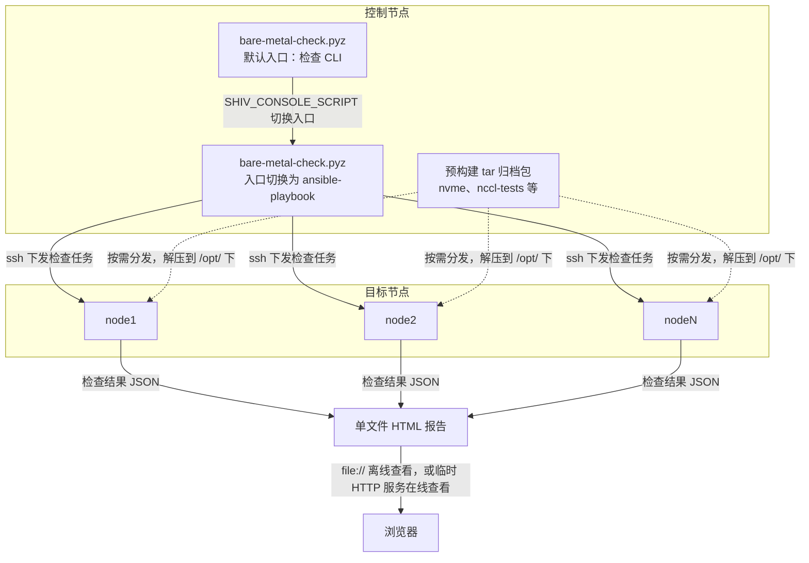
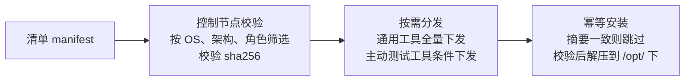

最近做了一个检查工具，对服务器基础环境进行检查，提前暴露可能影响后续部署和上线的问题。目标环境仅安装 Ubuntu 22.04/24.04 和必要的硬件驱动，不包含其他可利用的组件（比如 Docker），且通常不与外网连通，无法在线安装所需的工具。

目标环境没有可用的依赖，因此一个核心考量是：让执行检查所需的代码、依赖库、三方工具都自包含在检查工具内，同时不触及系统自身的包管理和标准路径，保持环境纯净。在多节点上执行任务，一个主流选择是 [Ansible](https://github.com/ansible/ansible)；Ubuntu 内置了 Python 3.10+，这一部分可以直接利用，除此之外的部分都由检查工具自包含。下文把运行检查工具、发起检查的机器称为控制节点，被检查的服务器称为目标节点。具体来说包含这些部分：

- 使用 Python 开发的检查工具主体代码，以及所需的依赖；
- Ansible 命令工具；
- 执行检查所需的三方工具，比如 [nvme-cli](https://github.com/linux-nvme/nvme-cli) 和 [nccl-tests](https://github.com/NVIDIA/nccl-tests) 等；
- 检查报告所需的 HTML 单文件模板；

最终交付物只有一个压缩包，用户解压后只需要执行：

```bash
dist/bare-metal-check.pyz run \
  --nodes <node1>,<node2>,<node3>
```

检查完毕后会启动一个 HTTP 服务并打开浏览器查看报告，报告支持下载和离线查看，整个过程不需要安装任何依赖。整体的分发与执行流程如下：



下面说明这几个部分如何自包含在检查工具内，以及如何在执行过程中分发到目标环境。

## 1. 将 Python 程序打包为单体文件

Python 程序由若干 `py` 文件和三方依赖组成。检查工具是一个临时使用的工具，不希望将这些文件和依赖放到全局标准路径下；除了把文件和依赖隔离在独立环境中，另一个目标是让用户完全不需要 Python 相关的背景知识，把工具当作一个普通可执行文件，上手即用。

### 1.1 主流方案比较

将 Python 程序打包为可执行产物的常见方案如下：

| 方案 | 产物形态 | Python 解释器 | 典型体积 | 适合场景 |
|---|---|---|---|---|
| [PyInstaller](https://pyinstaller.org/) | 单可执行文件 | 内置 | 大 | GUI/桌面应用、Windows 分发 |
| [cx_Freeze](https://github.com/marcelotduarte/cx_Freeze) | 目录或单文件 | 内置/外部 | 较大 | 跨平台桌面程序 |
| [Nuitka](https://nuitka.net/) | 编译后的二进制 | 内置 | 较大 | 性能敏感、需要保护源码 |
| [pex](https://github.com/pex-tool/pex) | 单 `.pex` 文件 | 外部 | 中等 | 多解释器环境、服务端脚本 |
| [zipapp](https://docs.python.org/zh-cn/3/library/zipapp.html) | 单 `.pyz` 文件 | 外部 | 小 | 依赖系统 Python 的 CLI 工具 |
| [venv](https://docs.python.org/zh-cn/3/library/venv.html) | 目录 | 外部 | 小 | 可联网、可写安装脚本的环境 |

这些方案的关键差异在于是否把 Python 解释器本身也打包进去：PyInstaller、Nuitka 把解释器一起分发，产物独立但体积大；zipapp、pex 假设目标环境已有兼容的 Python，只打包代码和依赖，产物小但需要外部解释器。

### 1.2 zipapp + shiv

目标环境已经确定有 Python 3.10+，再打包一个解释器进去既浪费空间也增加复杂度。

[zipapp](https://docs.python.org/zh-cn/3/library/zipapp.html) 从 Python 3.5 起内置于标准库，支持创建包含 Python 代码的压缩文件，直接由 Python 解释器执行，可以理解为带 shebang 的 zip 文件。

```sh
python -m zipapp myapp -m "myapp:main"
python myapp.pyz
<output from myapp>
```

[shiv](https://github.com/linkedin/shiv) 在 zipapp 的基础上，把第三方依赖一起装进 zip。检查工具的依赖里包含 `ansible-core`，它会拉入 `cryptography`、`cffi`、`PyYAML`、`MarkupSafe` 等带原生扩展的间接依赖。只要这些库提供 [manylinux](https://github.com/pypa/manylinux) wheel，shiv 就可以把 wheel 原样放进 zip，不需要在构建时本地编译；代价是构建产物与平台和架构绑定。例如在 x86_64 Linux 上构建，产物中使用的就是对应的 x86_64 Linux wheel；如果需要 arm64 或 macOS 产物，则要在对应平台上重新构建。

打包方式如下：

```bash
shiv \
  --output-file bare-metal-check.pyz \
  --entry-point bare_metal_check.cli:main \
  --python '/usr/bin/env python3' \
  .
```

shiv 默认会把构建时本机解释器的绝对路径写进 zip 首行的 shebang，这个路径在目标环境中可能不存在；`--python '/usr/bin/env python3'` 把 shebang 改为从 PATH 查找解释器，避免这个问题。`--entry-point` 指定启动时执行的函数。可以配合 [uv](https://docs.astral.sh/uv/) 的 `uv.lock` 锁定依赖版本，构建时用 `uv run --locked shiv ...` 调用，保证每次构建的依赖一致。

这种方式的产物体积只有几 MiB，构建流程也简单。对于「目标环境只有系统 Python、不能联网使用 pip」的场景，是贴合的选择。

## 2. 让 Ansible 复用同一个 pyz

检查工具打包进 pyz 后，接下来要处理的问题是：Ansible 由哪里提供、如何调用？有以下几种选择：

| 方案 | 是否自包含 | 与 pyz 统一构建打包 | 说明 |
|---|---|---|---|
| 依赖环境中预装的 Ansible | 否 | 差 | 现场需单独安装，会污染环境 |
| 在交付包里额外放一个 ansible 二进制 | 部分 | 中 | 多一个需要单独维护的文件 |
| 同一个 pyz 通过环境变量切换入口 | 是 | 高 | 构建和打包与 pyz 完全一致 |

第三种思路最符合「单文件、单 Python 环境、零额外依赖」的目标。

### 2.1 SHIV_CONSOLE_SCRIPT 机制

shiv 在打包时会执行一次 pip 安装，`ansible-core` 提供的 `ansible-playbook`、`ansible-inventory` 等可执行入口都会被放进 zip 内的 `site-packages/bin/` 目录。shiv 启动时如果发现 `SHIV_CONSOLE_SCRIPT` 环境变量，就不执行默认的 `--entry-point`，而是执行 zip 里同名的入口脚本。

也就是说，同一个 `.pyz` 文件有两种启动方式：

```sh
# 默认入口：运行 CLI
python3 bare-metal-check.pyz run --nodes ...

# 切换入口：运行 ansible-playbook
SHIV_CONSOLE_SCRIPT=ansible-playbook python3 bare-metal-check.pyz site.yml
```

实际代码中，调用方只需设置好环境变量，再用同一个 pyz 路径启动子进程即可：

```python
env = os.environ.copy()
env["SHIV_CONSOLE_SCRIPT"] = "ansible-playbook"
subprocess.run([sys.executable, pyz_path, playbook, ...], env=env)
```

### 2.2 限定从 pyz 启动

Python 程序可以有很多种构建和调用方式，而检查工具希望限定为只以 zipapp 方式执行，`SHIV_CONSOLE_SCRIPT` 也只有在文件确实是 zipapp 时才有效。因此检查工具在启动时会检查 `sys.argv[0]` 是预期的 `.pyz` 文件，并使用同一个文件作为调用 Ansible 的入口；否则直接退出，提醒用户从 `.pyz` 启动。

这样 CLI 和 Ansible 使用的是同一个 zip 里的库，版本必然一致，也避免了在现场再装一份 Ansible。

## 3. 离线工具的构建与分发

CLI 和 Ansible 已经能随 pyz 一起分发，还剩下目标节点上执行检查所需的工具。例如 `dmidecode`、`smartctl`、`lspci`、`nvme` 等命令和 NCCL 测试程序，目标环境里不一定有，也无法通过 apt 在线安装。

### 3.1 可选思路

| 方案 | 是否自包含 | 对环境的影响 | 说明 |
|---|---|---|---|
| 目标节点 apt 在线安装 | 否 | 介入系统包管理 | 现场无外网，且会污染被检环境 |
| 通过 Docker 镜像运行检查 | 否 | 需要容器运行时 | 目标节点不一定有 Docker，镜像守护进程本身会改变环境 |
| 控制节点分发预构建的 tar 归档包 | 是 | 仅写入 `/opt/` 下的独立目录 | 不依赖系统包管理，按需安装，可校验完整性，通过 PATH 环境变量控制调用 |

由于目标环境的约束，这里选择第三种方案：由控制节点校验并向目标节点分发预构建的 tar 归档包。归档在目标节点上解压到 `/opt/` 下的独立目录，再通过 PATH 环境变量让检查命令优先使用归档内的工具，而不是系统路径里的版本。

### 3.2 构建与解压位置无关的归档

离线归档包里包含命令二进制和它们依赖的动态库，核心问题是：如何让这些二进制在目标节点的 `/opt/...` 目录下找到这些库，而不是依赖系统路径？

Linux 可执行文件通过 `rpath`（运行时库搜索路径）决定从哪里加载动态库。rpath 通常写成绝对路径，比如 `/usr/lib/x86_64-linux-gnu`，这会导致二进制只能在该固定位置找到库。为了让一个 tar 包在任意解压位置都能工作，需要让二进制从它自己所在的位置出发去查找库。

Linux 动态链接器提供了一个标准机制来实现这一点：`$ORIGIN` 是 glibc [`ld.so`](https://www.man7.org/linux/man-pages/man8/ld.so.8.html) 支持的特殊标记，表示二进制文件自身所在的目录。借助这个标记，rpath 可以写成相对路径，例如 `$ORIGIN/../lib` 表示「从二进制所在的目录往上退一级，再进入 lib 目录」。

[`patchelf`](https://github.com/NixOS/patchelf) 用于修改已有二进制的 rpath，例如：

```sh
patchelf --set-rpath '$ORIGIN/../lib' bin/<tool>
```

这样无论归档解压到 `/opt/bare-metal-check-tools` 还是其他目录，`bin/<tool>` 都会去 `../lib` 找自己的私有库。

不同类型的工具，构建方式不同。

**`dmidecode`、`lspci`、`nvme` 这类命令**来自 Ubuntu 软件包里的现成二进制，构建方式更接近「重打包」：在干净的 Ubuntu 22.04 容器里用 apt 安装所需软件包，把二进制拷出来，再用 `ldd` 扫描每个二进制依赖的共享库。动态链接器和 glibc 等基础库由 Ubuntu 系统本身提供，无需打包，其余私有库才拷贝进归档。选择在 Ubuntu 22.04 上构建这份归档，是因为其 glibc 版本较低，产物在 glibc 更新的 Ubuntu 24.04 上也能运行。

**NCCL 测试工具则必须从源码编译**：它依赖特定版本的 NCCL、CUDA 和 GPU 架构，目标节点上这些组件的版本无法预期。构建时在一个带 CUDA toolkit（开发工具包）的容器里固定源码版本并编译，再连同 NCCL 库和 Open MPI 一起打包。它的二进制同样用 `patchelf` 改成相对路径的 rpath，让命令在解压目录内找到所有依赖。

无论哪一类归档，都不包含 NVIDIA 驱动、CUDA toolkit、OFED（InfiniBand 驱动栈）、固件、内核模块等与目标环境绑定的组件。这些属于目标节点的既有条件，缺失时应由检查项暴露，而不是由检查工具补齐。唯一的例外是 CUDA 运行时库（libcudart）：NCCL 测试运行需要它，因此随 NCCL 归档一起打包。

两类归档的共同点是：都用 `patchelf` 把绝对路径改成相对路径，使 tar 包可以在目标节点的任意位置解压运行。

### 3.3 清单、校验与按需分发

每个离线归档对应一份清单（manifest），记录适用节点角色、适用 OS 版本、安装目的地、归档内必须存在的路径等元信息。清单纳入版本管理，但**不记录 size/sha256**；完整性数据属于构建产物，由构建脚本生成单独的校验文件。打包交付时会强制检查清单声明的每个归档都存在，且重新计算的 sha256 与校验文件一致。

分发不是一开始就把所有归档推送到全部节点，而是按检查阶段和节点角色按需进行，整体流程如下：



1. **控制节点校验**：根据目标节点的 OS 版本、架构和角色，从清单中筛选适用的归档，并校验其完整性。
2. **按需分发**：通用命令工具在检查初期分发给所有节点；NCCL 测试这类会在节点上施加负载的主动测试（区别于只读检查），只在 GPU 节点通过驱动、CUDA 等前置资格检查并明确允许主动测试后才下发。
3. **幂等安装**：目标节点上记录已安装归档的摘要，与待安装的归档一致则跳过传输；需要安装时先传到临时目录，校验后再解压到 `/opt/` 下的独立目录。

## 4. HTML 报告：单文件自包含 + 数据独立

报告是检查工具的最终产出，而查看报告的环境同样可能离线、没有 Node.js、甚至没有 Python，因此报告本身也要自包含：一个文件、零外部依赖、双击就能打开。报告的实际页面如下：


常见的报告形态有几种：

| 方案 | 离线可用 | 是否需要本地服务 | 说明 |
|---|---|---|---|
| 静态 HTML + 外部 JSON | 否 | 是 | 需要 fetch，file:// 下受浏览器安全限制 |
| 单文件 HTML，数据内联 | 是 | 否 | 所有资源在文件内部，任意位置打开 |
| 本地 HTTP 服务动态渲染 | 是 | 是 | 需要服务进程，服务关闭后无法查看 |

这里选择第二种作为主要形态：模板和数据分离，模板一次性构建，数据在每次检查结束后注入。第三种则作为检查完成后临时分享的便利手段。

### 4.1 单文件模板 + base64 数据岛

前端模板用 Vue + Vite 开发，构建时通过 [vite-plugin-singlefile](https://github.com/richardtallent/vite-plugin-singlefile) 插件把 JS/CSS 全部内联，产出只有一个零外部请求的 HTML 文件。文件里预留一个数据占位符：

```html
<script type="application/json" id="report-data">__BASE64_REPORT_DATA__</script>
```

检查结束后，pyz 内的 Python 代码把本次结果 JSON 做 base64 编码，替换这个占位符，生成最终的 HTML 报告。用 base64 有两个好处：一是避免 JSON 里的 `</script>` 破坏 HTML 解析；二是 base64 字符集安全，即使现场只有 shell 也能手工完成注入。

前端读取时把 `<script type="application/json">` 当作纯数据容器，base64 解码后再按 UTF-8 还原文本，避免中文乱码。模板和数据各自演进、互不依赖，同一份模板可以生成任意多份报告。

### 4.2 file:// 与 http:// 两种访问

因为所有资源都已内联、数据在 DOM 内部，报告文件可以直接用 `file://` 协议打开，浏览器双击即可查看。没有 fetch 请求，也就不存在跨域或 file:// 安全限制问题，文件可以随意拷贝、归档或通过邮件发送。

检查命令完成后，CLI 也会启动一个临时静态服务，打印局域网 URL，方便同事直接在浏览器中查看。报告检测到自己是通过 `http://` 协议访问时，会额外渲染一个下载按钮，方便直接把报告保存到本地，省去手工拷贝文件的步骤。

## 5. 重操旧业

这套方案的核心思路是把「自包含」贯彻到交付流程的每一层，从代码依赖、Ansible、三方工具，再到报告，整个流程对现场环境的要求降到了一个 Python 3 解释器和一个可选的浏览器。

实际上这并不是我第一次做巡检工具：差不多四五年前，我就做过一个类似的工具。回顾来看，我在方案的设定和技术偏好上发生了很多变化。

那时的我更看重组件的编码灵活性、接口的标准性，抵触做一个脚本小子。所以那个时候的我非常讨厌 ansible，在实现类似工具时，我尽可能用 http 接口来标准化各个环节，包括分发逻辑和文件传输。但其实并没有做得很好：

- 组件自身的 bootstrap 仍然需要 ansible 来执行，毕竟 ssh 才是真正意义上的 linux native；没有做到自举是当时的一大遗憾；
- http 接口虽然形式上标准，避免了脚本小子的作风，但是和 ansible 这种业界事实标准差距不小，无法借力已经存在的丰富生态；那时也缺乏插件的模块化经验，机制薄弱，代码还混乱；
- 当时为了满足报告可编辑的需求，采用了 [docxtpl](https://github.com/elapouya/python-docx-template) 来渲染报告，它是一种组合 docx xml 和 jinja 语法的做法，虽然某种程度上也算做到了数据和模板分离，但远没有 html 生态灵活和易于维护。

再次做类似的工具，我不再认为使用 ansible 就是脚本小子。我认为关键在于数据接口的标准化：这一次我没有使用 http 接口来定义标准结构，而是用 json schema 来约定每一个检查模块的输出内容。脚本小子的问题不在于写冗长的脚本，而是不会因地制宜。使用 ansible 后节省大量精力用于思考更关键的问题，这就值得。

我记得当时实现那个工具的初版时，我用了一个月；而现在有 AI 辅助之后，我只用了一周（当然后续的打磨还是花了不少时间），还附带了一份精美的 html 报告，真让人唏嘘不已。
